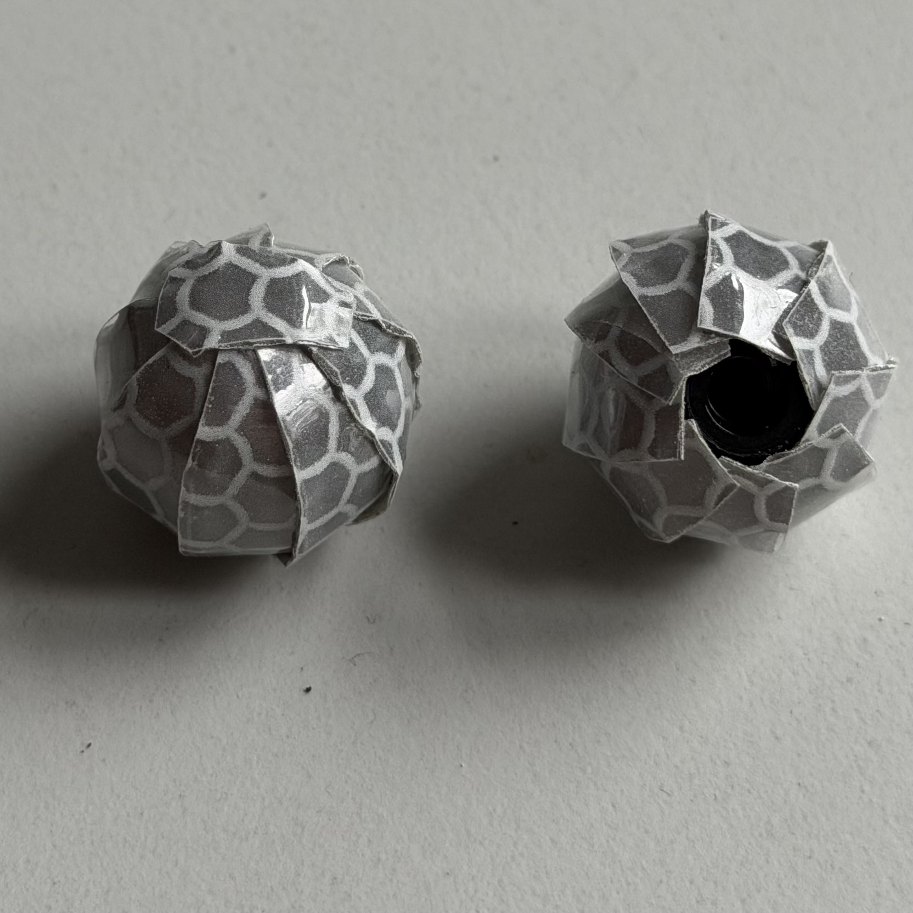

Design
======

MoCap markers are used to track the position and orientation of objects in the tank. They are attached to a rigid-body.
Commercial Qualisys markers are relatively expensive and not very durable,
despite being specified as waterproof. Therefore, custom markers as those in :numref:`fig-custom-marker` are designed.
The markers are 3D printed and laminated with reflective tape.

.. _fig-custom-marker:

   Example of custom MoCap marker with reflective tape.

List of Materials
-----------------

Reflective Tape
^^^^^^^^^^^^^^^

* `IFM Reflective Tape (Conrad) <https://www.conrad.de/de/p/ifm-electronic-e20401-reflektorfolie-e20401-1-st-675711.html>`_

Others 
^^^^^^^^^^^^^^^^

* Hexagon nut ISO 4032 – M4 – A2 stainless steel
* Hexagon socket set screw with cone point ISO 4027 – M4 x 30 – A2 stainless steel
* Superglue
* Sandpaper

Manufacturing Files
-------------------

Cutting Template
^^^^^^^^^^^^^^^^

* :download:`Reflective Tape Cutting Template (PDF) <cutout.pdf>`

Marker CAD – 13 mm
^^^^^^^^^^^^^^^^^^

* :download:`Bottom Part (STL) <13mm_Bottom_Part.stl>`
* :download:`Nut Part (STL) <13mm_Nut_Part.stl>`
* :download:`Complete Print File (3MF) <Marker_13mm_mass_production.3mf>`

Marker CAD – 18 mm
^^^^^^^^^^^^^^^^^^

* :download:`Bottom Part (STL) <18mm_Bottom_Part_lower_nut.stl>`
* :download:`Nut Part (STL) <18mm_Nut_Part_lower_nut.stl>`
* :download:`Complete Print File (3MF) <Marker_18mm_mass_production.3mf>`

