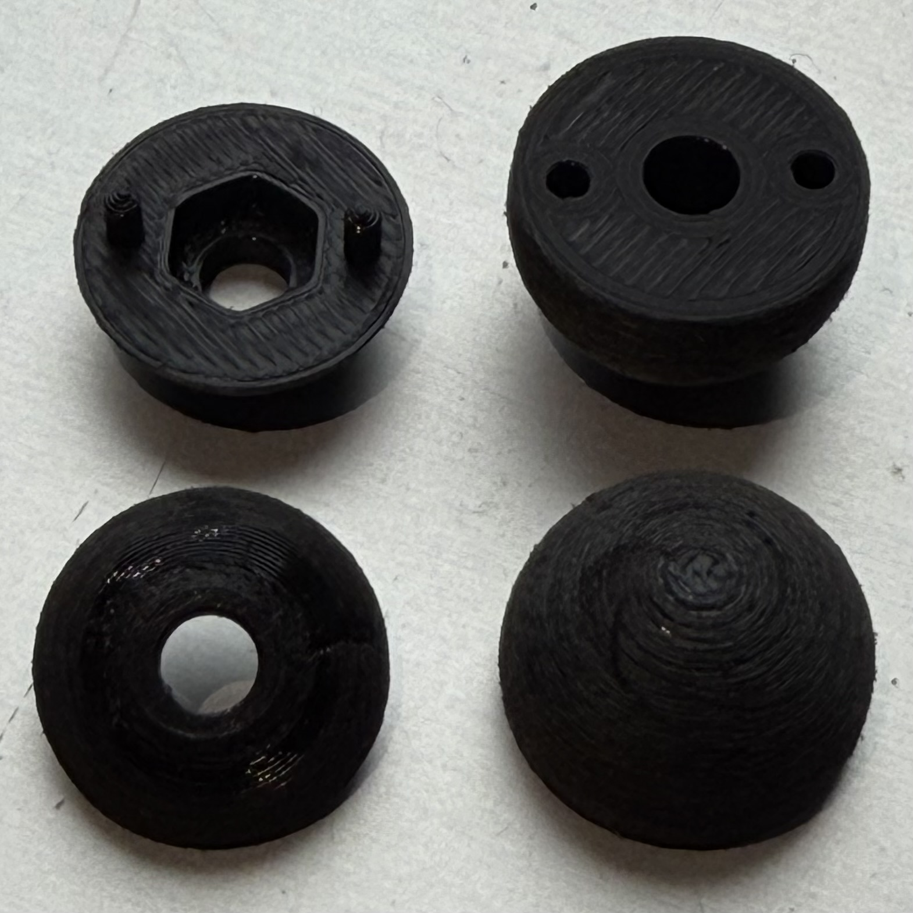
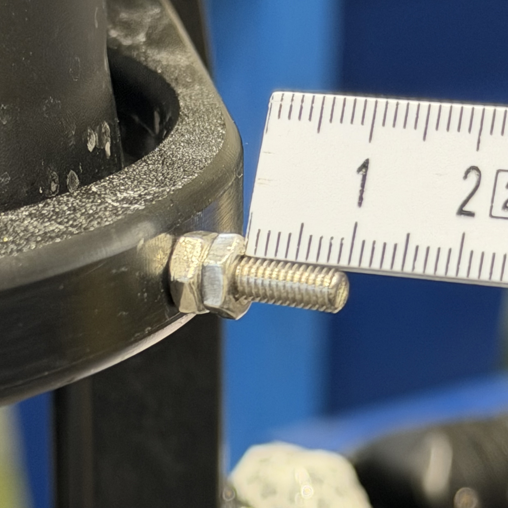

Fabrication
###########

The MoCap marker consists of:

- 3D printed body (nut part and bottom part)
- Reflective tape segments
- One M4 nut

Qualisys underwater markers have diameters of 14 mm and 19 mm.
This design replicates both sizes.

Since the reflective tape increases the diameter by approximately 1 mm,
the printed parts are designed with diameters of:

- 13 mm → final 14 mm marker
- 18 mm → final 19 mm marker

The following steps describe the 19 mm version.
The 14 mm version is identical.

3D Printing
===========

Print the nut part and bottom part shown in :numref:`fig-nut-bottom-parts`.

.. _fig-nut-bottom-parts:

   3D printed nut part (left) and bottom part (right).

Assembly
========

1. Insert an M5 nut into the nut part (left image in :ref:`fig-assembled-marker`).
2. Press the nut part and bottom part together firmly (right image in :ref:`fig-assembled-marker`).
3. If the fit is loose, apply a small amount of adhesive between the parts.

.. _fig-assembled-marker:

.. rubric:: Assembly images

.. list-table::
   :widths: 50 50
   :class: borderless
   :align: center

   * - .. image:: IMG_2503.jpeg
          :width: 300px

       | (a) M4 nut inserted into the nut part.
     - .. image:: IMG_2504.jpeg
          :width: 300px

       | (b) Parts pressed together.

Surface Preparation
===================

Sand the outer surface to improve adhesion.

.. tip::

   Screw the marker onto an M4 set screw, clamp the set screw in a drill,
   and rotate the marker while holding sandpaper against it.

Reflective Tape Application
===========================

The following steps describe the application of the reflective tape.
A visual summary of the process is shown in :ref:`fig-tape-application`.

The tape cannot be wrapped around the marker in one piece.
Apply multiple segments in a globe-like pattern.

1. Cut the tape using the template. The exact shape is not critical,
   but one end should be narrower. Approximately nine segments are required.
2. For the first segment, remove the backing only halfway and press it
   onto the marker.
3. Attach the remaining segments one by one. Align the wider end with
   the lower edge of the nut part.
4. Apply the segments with slight overlap.
5. Before placing the final segment, remove the remaining backing from
   the first segment.
6. Slide the last segment underneath the first segment.
7. Cover the top with a small circular piece for a clean finish.

.. note::

   The tape adhesive alone is usually insufficient for long-term use.
   Apply a small drop of superglue under each segment.

.. attention::

   Do not allow superglue to contact the reflective surface.
   It may damage the coating and reduce tracking quality.

.. _fig-tape-application:

.. rubric:: Reflective tape application steps

.. list-table::
   :widths: 33 33 33
   :class: borderless
   :align: center

   * - .. image:: IMG_2505.jpeg
          :width: 250px

       | (1)

     - .. image:: IMG_2513.jpeg
          :width: 250px

       | (2)

     - .. image:: IMG_2517.jpeg
          :width: 250px

       | (3)

   * - .. image:: IMG_2519.jpeg
          :width: 250px

       | (4)

     - .. image:: IMG_2521.jpeg
          :width: 250px

       | (5)

     - .. image:: IMG_2522.jpeg
          :width: 250px

       | (6)

   * - .. image:: IMG_2524.jpeg
          :width: 250px

       | (7)

     - .. image:: IMG_2518.jpeg
          :width: 250px

       | (Note)

     - 

Final Mounting
==============

1. Screw the M4 set screw into the BlueROV frame.
2. Lock it in place using two counter-tightened nuts, as in :numref:`fig-mounting`.
3. Screw the finished marker onto the set screw until it is firmly seated.

.. attention::

   Make sure the set screw does not stick out too far. Aim for approximately 10 mm.
   Otherwise, it may push the printed parts apart while tightening the marker.

.. _fig-mounting:

   Set screw installed in BlueROV frame.